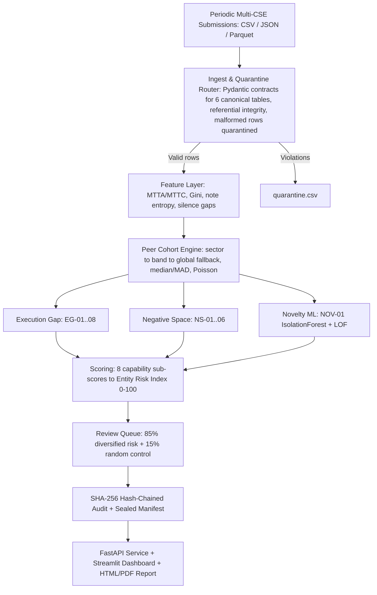

# SAT-SA Architecture Specification

**System:** SAT-SA (Supervisory Analytics Tool for SOC Assessment) · **Authority:** NCIIPC
**Operating Mode:** 100% air-gapped offline batch supervisory assessment · **Scale:** 10M+ alert rows, CPU-only

---

## 1. System Overview & Core Paradigms

SAT-SA evaluates periodic batch submissions (CSV/JSON/Parquet) of SOC alert metadata, case-management records, workflow/escalation data and asset inventories across Critical Sector Entities. It is strictly an offline **supervisory assessment lens** — not a SIEM, SOC or monitoring platform — benchmarking each entity's operational evidence against empirical peer cohorts.

- **EXECUTION_GAP (EG-01…08):** evidence contradicts claimed effectiveness — sub-minute critical closures, unescalated critical closures, acknowledged-but-unworked alerts, template-driven notes, repeat alerts without remediation, SLA-boundary bunching, analyst concentration, disposition drift.
- **NEGATIVE_SPACE (NS-01…06):** expected evidence absent — silent critical assets, suppressed threat categories, missing cases/escalations, volume deficits, operational silence, criticality-weighted coverage deficits.
- **NOVELTY (NOV-01):** unsupervised IsolationForest + LOF lane for previously unknown supervisory signals.

---

## 2. Component Modules

| Module | Responsibility |
|---|---|
| `satsa.schemas` | Pydantic contracts for the 6 canonical tables (timestamps, severities, foreign keys, optional KPI claims) |
| `satsa.ingest` | CSV/JSON/Parquet ingestion, column mapping, referential validation, quarantine routing, legacy adapters |
| `satsa.features` | Vectorized lifecycle durations, analyst Gini, note-text entropy, asset-silence tracking |
| `satsa.peers` | Cohort clustering (sector / size band / operating model), robust median-MAD baselines with zero-MAD guard, Poisson expected-frequency models |
| `satsa.detectors` | 15 detectors emitting structured findings: observed value, peer baseline, confidence, evidence references |
| `satsa.store` | Canonical Parquet store + DuckDB views — scale layer for 10M+ rows (polars-first I/O) |
| `satsa.scoring` | Severity-weighted deviation blending → 8 capability sub-scores + Entity Supervisory Risk Index (0–100) with QoQ trend |
| `satsa.queue` | Budgeted review queue: 85% risk-diversified + 15% random control, with per-item selection reasons |
| `satsa.audit` | SHA-256 hash-chained append-only log; sealed manifest of input, code and parameter hashes |
| `satsa.claim_reality` / `satsa.feedback` | Claim-vs-Reality credibility verdicts; examiner confirm/dismiss ledger that re-weights scores |
| `satsa.report` (+ `minipdf`, Jinja2 template) | Supervisory HTML/PDF report built only from audited artifacts |
| `satsa.secure_store` / `satsa.auth` | Encrypt-then-MAC vaults (PBKDF2-HMAC-SHA256, 200k) and RBAC (administrator / supervisor / auditor) |

---

## 3. Detector Registry

| ID | Concept | Capability | Detection Logic |
|---|---|---|---|
| EG-01 | EXECUTION_GAP | Investigation | Alert MTTC vs cohort $p_5$ or robust Z $z_{\text{MAD}} < -2.5$ (Critical/High) |
| EG-02 | EXECUTION_GAP | Escalation | Critical/High escalation rate vs peer median ($z_{\text{MAD}} < -2.0$) |
| EG-03 | EXECUTION_GAP | Investigation | Share of acknowledged alerts with zero workflow investigation events |
| EG-04 | EXECUTION_GAP | Discipline | Char 3–5 gram TF-IDF cosine similarity $\ge 0.85$ + low Shannon token entropy |
| EG-05 | EXECUTION_GAP | Resilience | Repeat alerts on identical asset + rule ($\ge 5$) without remediation |
| EG-06 | EXECUTION_GAP | Governance | Non-uniform closure clustering at SLA boundary intervals ($p < 0.01$) |
| EG-07 | EXECUTION_GAP | SecOps | Analyst closure Gini $> 0.70$ and top-analyst share $> 50\%$ |
| EG-08 | EXECUTION_GAP | Governance | CUSUM drift on false-positive disposition ratios |
| NS-01 | NEGATIVE_SPACE | Detection | Monitored critical assets with zero alerts/events in period |
| NS-02 | NEGATIVE_SPACE | Detection | Poisson suppression test ($p < 0.01$) on expected category frequencies |
| NS-03 | NEGATIVE_SPACE | Governance | Alerts lacking case linkage; high-severity cases lacking escalation |
| NS-04 | NEGATIVE_SPACE | Detection | Total volume $< 0.25\times$ size-adjusted peer expectation |
| NS-05 | NEGATIVE_SPACE | Detection | Operational silence windows ($\ge 12$ consecutive hours) |
| NS-06 | NEGATIVE_SPACE | Detection | Criticality-weighted monitoring coverage vs cohort $p_{20}$ |
| NOV-01 | NOVELTY | Emerging | IsolationForest (200 trees) + LocalOutlierFactor ($k=5$) on cohort-normalized entity-month vectors |

---

## 4. AI/ML Disclosure & Governance (PS Section 5)

- **Architecture (ML-1):** unsupervised IsolationForest + LOF for the novelty lane; character n-gram TF-IDF for note analysis. No supervised labels, no generative or hosted models.
- **Hardware (ML-2):** CPU-only, 4 cores, no GPU; 1.5 GB RAM at 1M rows, 5.1 GB at 5M, ~10.3 GB projected at 10M (measured via `scripts/scale_test.py`).
- **Offline training & inference (ML-3):** every model fits and predicts inside the local pipeline run; zero network access, external APIs or model downloads.
- **Update mechanism (ML-4):** versioned thresholds/parameters in `satsa/config.py`, hashed into the sealed manifest; rollback = revert config and re-run.
- **Explainability (ML-5) & auditability (ML-6):** no automated decisions — each finding carries reason, evidence, peer baseline, confidence and parameters; SHA-256 hash-chained audit log + signed run manifest provide tamper-evident traceability (`python -m satsa.audit --verify`).

---

## 5. Validation Summary

Deterministic ground-truth benchmark (12 CSEs, 3 sectors, 39,211 alerts, 4,747 seeded fault instances, seed 42): **2.28× lift over random sampling at a 10% review budget** (precision 26.7%, recall 14.0%), Spearman ρ = 0.36 vs ground-truth fault burden, with full layer ablation. Measured scale: 1M rows in 152 s / 1.5 GB, 5M in 592 s / 5.1 GB. Methodology, ablation tables and the expert-review comparison protocol: `README.md` → *Empirical Validation Benchmark Results*; executable at `validation/run_validation.py --seed 42`.
