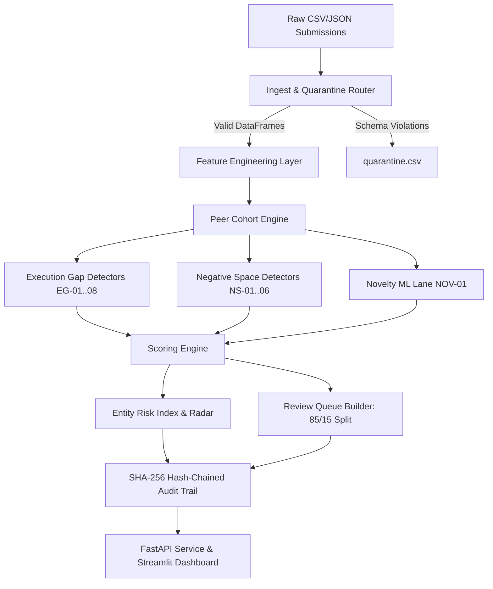

# SAT-SA Architecture Specification

**System:** SAT-SA (Supervisory Analytics Tool for SOC Assessment)  
**Authority:** National Critical Information Infrastructure Protection Centre (NCIIPC)  
**Operating Mode:** 100% Air-Gapped / Offline Batch Supervisory Assessment  

---

## 1. System Overview & Core Paradigms

SAT-SA evaluates periodic batch submissions (CSV/JSON) of Security Operations Center (SOC) telemetry, incident management logs, and asset inventories across Critical Sector Entities (CSEs). Unlike SIEMs or real-time detection platforms, SAT-SA operates strictly as an offline **supervisory assessment lens** comparing entity behaviors against empirical peer cohorts.

```
       [ Periodic Multi-CSE Submissions: CSV / JSON ]
                            |
   +-------------------------------------------------+
   | 1. CANONICAL INGESTION & QUARANTINE ROUTER     |
   |    - Pydantic Schema Contracts (Alerts, Cases,   |
   |      Events, Escalations, Assets, Entities)     |
   |    - Referential Integrity & Quarantine Routing |
   +-------------------------------------------------+
                            |
   +-------------------------------------------------+
   | 2. GRANULAR FEATURE STORE                       |
   |    - Alert Lifecycle Durations (MTTA, MTTC)     |
   |    - Unworked & Escalation Deficit Ratios       |
   |    - Analyst Workload Gini & Note Text Entropy  |
   |    - Asset Telemetry Inactivity & Silence Gaps  |
   +-------------------------------------------------+
                            |
   +-------------------------------------------------+
   | 3. PEER COHORT STATISTICAL NORMALIZER           |
   |    - Hierarchical Fallback: Subsector -> Sector |
   |    - Robust Median / MAD (Zero-MAD Guarded)     |
   |    - Empirical Quantiles & Poisson Suppression  |
   +-------------------------------------------------+
                            |
   +-------------------------------------------------+
   | 4. MULTI-LANE SUPERVISORY DETECTORS (15)        |
   |    * EXECUTION_GAP (EG-01 to EG-08)             |
   |    * NEGATIVE_SPACE (NS-01 to NS-06)            |
   |    * NOVELTY LANE (NOV-01: IsolationForest/LOF) |
   +-------------------------------------------------+
                            |
   +-------------------------------------------------+
   | 5. SCORING & DIVERSIFIED REVIEW QUEUE           |
   |    - 8-Capability Area Weighted Blending        |
   |    - Entity Supervisory Risk Index (0-100)      |
   |    - 85% Risk Diversified + 15% Random Control  |
   +-------------------------------------------------+
                            |
   +-------------------------------------------------+
   | 6. CRYPTOGRAPHIC AUDIT & EXPLAINABILITY         |
   |    - SHA-256 Hash-Chained Append-Only Log       |
   |    - Sealed Run Manifest & Parameter Hashes     |
   +-------------------------------------------------+
          |                                   |
   +--------------+                   +---------------+
   | FASTAPI REST |                   | STREAMLIT UI  |
   | Offline API  |                   | Examiner View |
   +--------------+                   +---------------+
```

### Core Supervisory Paradigms
- **EXECUTION_GAP:** Records exist but contradict claimed operational effectiveness (e.g., sub-minute critical alert closures, boilerplate template notes, closure bunching at SLA boundaries, analyst concentration).
- **NEGATIVE_SPACE:** Expected security evidence is missing (e.g., silent critical assets, suppressed threat categories, unescalated high-severity cases, volume deficits below peer baselines).

---

## 2. Component Pipeline & Data Flow



### Component Modules
1. **`satsa.schemas`**: Pydantic models enforcing ISO timestamps, valid dispositions, severity tiers, and foreign key relations across all 6 canonical tables.
2. **`satsa.ingest`**: Ingestion engine with automated column mapping, referential integrity validation, quarantine routing, and legacy format adapters.
3. **`satsa.features`**: Vectorized feature extraction compiling alert-level duration metrics, analyst Gini coefficients, Shannon text entropy, and asset silence trackers.
4. **`satsa.peers`**: Dynamic cohort clustering by sector, size band, and operating model. Computes robust median/MAD baselines with zero-dispersion fallback guards and Poisson expected-frequency models.
5. **`satsa.detectors`**: 15 modular anomaly detectors yielding structured `Finding` records with observed values, peer baselines, confidence ratings, and exact evidence references.
6. **`satsa.scoring`**: Severity-weighted deviation aggregation producing 8 capability sub-scores (Detection, Investigation, Escalation, Response, SecOps, Governance, Discipline, Resilience) and an aggregate Entity Risk Index (0–100).
7. **`satsa.queue`**: Examiner review queue constructor sampling 85% diversified high-risk cases and 15% uniform random controls for statistical calibration and anti-gaming protection.
8. **`satsa.audit`**: Cryptographically sealed execution logging using SHA-256 block hashing and run manifests recording input file checksums, code hashes, and detector parameters.

---

## 3. Detector Registry

| ID | Concept | Capability Area | Mathematical Formulation / Detection Logic |
|---|---|---|---|
| **EG-01** | EXECUTION_GAP | Investigation | Alert MTTC vs peer cohort $p_5$ or robust Z $z_{\text{MAD}} < -2.5$ on Critical/High alerts. |
| **EG-02** | EXECUTION_GAP | Escalation | Entity Critical/High escalation rate vs peer median ($z_{\text{MAD}} < -2.0$). |
| **EG-03** | EXECUTION_GAP | Investigation | Proportion of acknowledged alerts with zero workflow investigation events. |
| **EG-04** | EXECUTION_GAP | Discipline | Character n-gram TF-IDF cosine similarity $\ge 0.85$ and low Shannon token entropy. |
| **EG-05** | EXECUTION_GAP | Resilience | Recurrent alert volume on identical asset + rule ($\ge 5$) without remediation. |
| **EG-06** | EXECUTION_GAP | Governance | Non-uniform closure clustering at SLA boundary intervals ($p < 0.01$). |
| **EG-07** | EXECUTION_GAP | SecOps | Analyst closure concentration Gini coefficient $> 0.70$ and top analyst share $> 50\%$. |
| **EG-08** | EXECUTION_GAP | Governance | Cumulative Sum (CUSUM) drift detection on false-positive disposition ratios. |
| **NS-01** | NEGATIVE_SPACE | Detection | In-scope monitored critical assets with 0 alerts/events over assessment period. |
| **NS-02** | NEGATIVE_SPACE | Detection | Poisson suppression test ($p < 0.01$) on expected category frequencies. |
| **NS-03** | NEGATIVE_SPACE | Governance | Alerts lacking case linkages and high-severity cases lacking mandatory escalations. |
| **NS-04** | NEGATIVE_SPACE | Detection | Entity total alert volume $< 0.25\times$ size-adjusted peer expectation. |
| **NS-05** | NEGATIVE_SPACE | Detection | Operational silence windows ($\ge 12$ consecutive hours) via time-gap analysis. |
| **NS-06** | NEGATIVE_SPACE | Detection | Criticality-weighted asset monitoring coverage ratio vs peer cohort $p_{20}$. |
| **NOV-01** | NOVELTY | Emerging | Unsupervised IsolationForest (200 estimators) + LocalOutlierFactor ensemble. |

---

## 4. AI/ML Disclosure & Governance

- **Model Architectures:** Unsupervised Isolation Forest (200 trees, sub-sampling) combined with Local Outlier Factor (LOF, $k=5$ neighbors) operating on cohort-normalized feature vectors.
- **Hardware Constraints:** 100% CPU-only execution (zero GPU requirements). Runs end-to-end on 8-core, 16GB RAM workstations.
- **Offline Training & Inference:** All models fit and predict on local entity-month matrices. Zero network access, external APIs, or hosted LLMs.
- **Model Updating & Rollback:** Detector rules and model hyperparameters are stored in immutable, versioned configuration files (`satsa.config`). Updates are distributed via cryptographically signed offline packages.
- **Explainability & Human-in-the-Loop:** SAT-SA does not make automated decisions. Every finding provides plain-language reasons, peer comparison charts, percentiles, confidence ratings, and direct links to evidence rows.

---

## 5. Measured Validation Benchmark Summary

*Evaluated on deterministic ground-truth benchmark (12 CSEs across 3 sectors, 39,211 alerts, 4,747 injected fault instances):*

| Review Budget | Items Examined | True Positives | Precision@k | Recall@k | Lift vs Random Sampling |
|---|---|---|---|---|---|
| **5% Budget** | 1,246 | 346 | **27.8%** | **7.3%** | **2.12x** |
| **10% Budget** | 2,495 | 666 | **26.7%** | **14.0%** | **2.28x** |
| **20% Budget** | 4,990 | 1,315 | **26.4%** | **27.7%** | **1.90x** |

- **Ranking Consistency:** Spearman rank correlation $\rho = 0.3601$ against ground-truth entity fault burden.
- **Ensemble Ablation (at 10% Budget):**
  - *Rules Only:* 685 findings (10.3% Precision, 5.4% Recall)
  - *Stats Only:* 1,718 findings (26.5% Precision, 13.9% Recall)
  - *ML Novelty Only:* 13 findings (6.7% Precision, 3.5% Recall)
  - *Full SAT-SA Ensemble:* 2,416 findings (26.7% Precision, 14.0% Recall)
